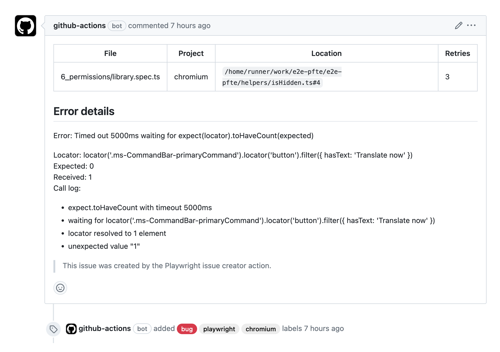

# Playwright Issue Creator

[](https://github.com/estruyf/playwright-github-issue-creator/actions/workflows/checks.yml) [](https://visitorbadge.io/status?path=https%3A%2F%2Fgithub.com%2Festruyf%2Fplaywright-github-issue-creator)

This GitHub Action creates issues for failed tests in Playwright.



## Prerequisites

This GitHub Action uses the JSON report from the [Playwright JSON reporter](https://playwright.dev/docs/test-reporters#json-reporter). You can generate this report by running your tests with the following command:

```bash
PLAYWRIGHT_JSON_OUTPUT_NAME=results.json npx playwright test --reporter=json
```

## Inputs

The GitHub Action can be configured with the following inputs:

| Name | Description | Type | Required | Default |
| --- | --- | --- | --- | --- |
| `github-token` | GitHub token to create the issue | `string` | `true` | `${{ github.token }}` |
| `report-path` | Path to the Playwright JSON report file | `string` | `true` | - |
| `issue-prefix` | Prefix for the issue title | `string` | `false` | - |
| `issue-labels` | Labels to add to the issue (comma-separated) | `string` | `false` | - |
| `issue-assignees` | Assignees to add to the issue (comma-separated) | `string` | `false` | - |
| `issue-footer` | Footer to add to the issue | `string` | `false` | `> This issue was created by the Playwright Issue Creator action.` |
| `add-project-label` | Add the project name as a label | `boolean` | `false` | `false` |
| `add-comment` | Add a comment to the issue if the issue already exists | `boolean` | `false` | `false` |
| `close-on-success` | Close the issue when the next test run is successful | `boolean` | `false` | `false` |
| `close-on-success-msg` | Message to add when closing the issue | `string` | `false` | `This issue was automatically closed after the test passed.` |
| `job-summary` | Add the issue information to the job summary | `boolean` | `false` | `true` |
| `quite` | Do not log any information | `boolean` | `false` | `false` |

## GitHub token permissions

The GitHub Action requires a token to read and write issues.

You can use the default GitHub token `${{ github.token }}` with the following permissions:

```yaml
jobs:
  e2e-testing:
    runs-on: ubuntu-latest
    permissions:
      contents: read
      issues: write
```

> [!NOTE]
> You can find more information about the GitHub token permissions [here](https://docs.github.com/en/actions/using-jobs/assigning-permissions-to-jobs#defining-access-for-the-github_token-scopes).

Or you can create your own Personal Access Token (PAT) with the following permissions `issues` -> `read & write` and provide it to the `github-token` input.

## Usage

The following example shows the minimal configuration to use the GitHub Action:

```yaml
- name: Playwright Issue Creator
  if: ${{ !cancelled() }} # Only run the action if the job is not cancelled
  uses: estruyf/playwright-github-issue-creator@v1.3.0
  with:
    report-path: results.json
```

The following example shows the full configuration to use the GitHub Action:

```yaml
- name: Playwright Issue Creator
  if: ${{ !cancelled() }} # Only run the action if the job is not cancelled
  uses: estruyf/playwright-github-issue-creator@v1.3.0
  with:
    github-token: ${{ secrets.PAT_TOKEN }}
    report-path: results.json
    issue-prefix: 'E2E: '
    issue-labels: 'playwright, bug'
    issue-assignees: 'estruyf'
    issue-footer: '> Custom footer message'
    add-project-label: true
    add-comment: true
    close-on-success: true
    close-on-success-msg: "Automatically closing after successful test run"
    job-summary: true
    quite: false
```
